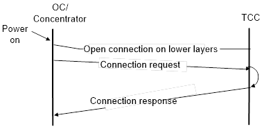
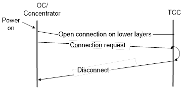
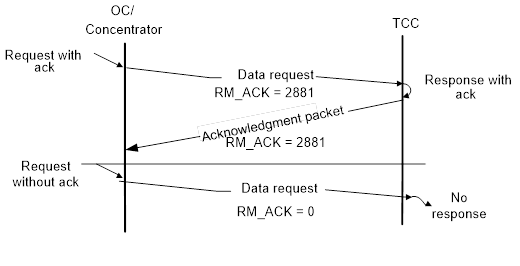
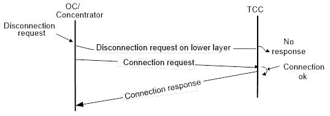

# Executive Summary

## Purpose

This document defines the communication interface between the central
system and the distributed object controller system (OCS).

This specification is loosely based on the FFFIS TCC-OCS specification
for ERTMS-R (Level 3) systems.

## Scope

The specification deals with all aspects of the communication interface.
However, a few options are identified as selectable. To fully specify
the interface for a specific application, all such options must also be
specified.

## Abbreviations

| Term | Explination |
| ---:    | --- |
| CENELEC | Comité Européen de Normalisation Electrotechnique |
| CRC     | Cyclic Redundancy Check |
| CRCC    | Cyclic Redundancy Check Code |
| DHCP    | Dynamic Host Configuration Protocol |
| ERTMS   | European Rail Traffic Management System |
| ETCS    | European Train Control System |
| HTTPS   | Hyper Text Transfer Protocol Secure |
| IL      | Interlocking |
| IP      | Internet Protocol |
| OC      | Object Controller |
| OCS     | Object Controller System |
| RAMS    | Reliability, Availability, Maintainability and Safety |
| RBC     | Radio Block Centre |
| SRS     | System Requirements Specification |
| SFTP    | Secure File Transport Protocol |
| SSH     | Secure Shell |
| TCC     | Traffic Control Centre |

## Definitions

| Term     | Definition |
| :---:    | --- |
| Application layer | The application layer is the seventh level of the seven-layer OSI model. It interfaces directly to and performs common application services for the application processes |
| Data link layer | At this layer, data packets are encoded and decoded into bits. It furnishes transmission protocol knowledge and management and handles errors in the physical layer, flow control and frame synchronization
| Network layer | This layer provides switching and routing technologies, creating logical paths for transmitting data from node to node. Routing and forwarding are functions of this layer, as well as addressing, internetworking, error handling, congestion control and packet sequencing
| Physical layer | This layer conveys the bit stream - electrical impulse, light or radio signal -- through the network at the electrical and  techanical level. It provides the hardware means of sending and receiving data on a carrier, including defining cables, cards and physical aspects
| Routing | Routing is the technique by which data finds its way from one host computer to another |
| Telnet | Protocol for remote log in over TCP/IP |
| Transport layer | This layer provides transparent transfer of data between end systems, or hosts, and is responsible for end-to-end error recovery and flow control. It ensures complete data transfer.

# Version Management

The revision identity of this protocol specification consists of two numbers:

The major number, which reflects the application protocol version
number, i.e. implementations with the same protocol version number must
be functionally and layout-wise compatible (see [here](#CONNECTION_PROCEDURE) for details)

The minor number, which denotes changes which are not relevant to the
behaviour of the application protocol.

# Lower Protocol Layers

## Physical Layer

The physical layer defines all electrical and physical specifications for devices.

This includes the layout of pins (connectors), voltages, and cable specifications.

Connection interface in this layer is Ethernet based with a RJ-45 connector.

## Network Layer

IP shall be used as network layer protocol.

## Transport Layer

TCP should be used as transport layer protocol, as it provides CRC checks and
guarantees delivery as well as in order delivery.

If any other protocol is used, it is up to the implementation to add
these functions or make sure that the other transport layer provides it
as well.

# Application Protocol

## Protocol Components

This chapter describes the message format used in the application protocol.
Format is described by two components: Message and Packet.

A Message consists of a header and one. The header and the packets are composed
of Variables.

The layout of the application protocol PDU shall be as follows:

```
+--------+--------+
| Header | Packet |
+--------+--------+
```

### Definition of Variables and rules for variable coding

Variables shall be used to encode single data values. Variables cannot
be split in minor units. The whole variable has one type (meaning).

Variables may have special values, which are related to the basic
meaning of the variable.

Names of variables are unique. A variable is used in context with the
meaning as described in the variable definition. Variables with
different meanings have different names.

Signed values shall be encoded as 2’s complement.

When transmitting, the most significant byte shall be transmitted first
(network byte order).

All Variables have one of the following prefixes:

| Prefix| Description       |
| ----- | ----------------- |
| RL_   |  Length           |
| RM_   |  Miscellaneous    |
| RN_   |  Number           |
| RNID_ |  Identity Number  |
| RQ_   |  Qualifier        |
| RT_   |  Time/Date        |
| RX_   |  Text string      |
| RXID_ |  Identity string  |

All variables are listed in alphabetical order [here](#VARIABLE_DEFINITIONS).

Length of variables is given in bytes.

Text variables (`RX_...` and `RXID_...`) have variable length, and shall
be terminated by a null byte (value 0). Embedded null bytes are not
allowed.

### Definition of Packets and rules for packets handling

Packets are multiple variables grouped into a single unit, with a
defined internal structure.

This structure consists of a unique packet number, the length of the
packet in bytes and an information section containing a defined set of
variables. The packet structure is defined as follows:

| Variable                          | Length |  Comment
|---------------------------------- | ------ | ---------------------------------------------------------
|  RNID_PACKET                      |   1    | [Packet identifier](#PACKET_DEFINITIONS)
|  RL_PACKET                        |   1    | Packet length (N + 3)
|  RM_ACK                           |   1    | Packet instance identity for acknowledge
|  Other variables in packet if any |   N    | Refer to packet definition in section [Packet identifier](#PACKET_DEFINITIONS)

The data element transmission order shall respect the order of data
elements listed in the packet definition (from top to bottom).

The packet length in [RL_PACKET](#RL_PACKET) shall be the length in number of bytes
of the whole packet.

The variable [RM_ACK](#RM_ACK) contains a numerical identification of the packet
instance, to be used when returning an `Acknowledgement Package`. A value of 0 indicates that no acknowledgement is
expected.

All packets are listed here [here](#PACKET_DEFINITIONS)

### Definition of a message and rules for message handling

A message is the whole application data transmitted at a given time on
the interface between TCC and a distributed unit. The message shall have
the following format:

| Variable        | Length          | Comment         | Format          |
|-----------------|-----------------|-----------------|-----------------|
| RL_MESSAGE      | 1               | Message length  | The massage  length shall be the length in number of bytes of the whole message. The total length of a message must not exceed the capabilities of the receiving unit.
| RXID_OBJECT     | Variable        | Identity of object unit | Messages shall object unit be treated by the receiver in the order of their reception.
| Packet list    | Variable        |                 | The message body shall consist of one or more [packets](#PACKET_DEFINITIONS). Some packets and its variables in the connection management section are constant, i.e. protocol version independent.

#### <a name="UNIT_IDENTIFCATION"></a>Unit Identification

Each object shall have a unique identity, to be included in each message
header ([RXID_OBJECT](#RXID_OBJECT)). The TCC does not need a name.

The identity consists of a null terminated UTF-8 string and must be
unique in the system so that no naming collisions occur.

#### <a name="CONNECTION_PROCEDURE"></a>Connection Procedure

Communication is always initiated from the distributed units. This makes
TCC independent of unit IP addresses, allowing for DHCP or similar
techniques to be used in the distributed system, as well as fixed IP
addresses.

On power up, the distributed unit

-   Initialises connection procedure in lower protocol layers
-   Sends a [Connection Request Packet](#pkt01)
-   Waits for a [Connection Response Packet](#pkt02)

While no response is received, connection attempts are repeated at a
configurable interval.

The exchanged packages contain protocol version information (see
[here](#APPLICATION_PROTOCOL_VERSION)). Both communication partners have to
verify the local node protocol version to be used according to the following
rules:

-   If the local node protocol version is the same as the remote node
    protocol version, then the communication is allowed.
-   If the local node protocol version is lower than the remote node
    protocol version, then the decision whether the connection is
    allowed, and control of it, is the responsibility of the remote node
    ‑ communication is allowed from the local node.
-   If the local node protocol version is higher than the remote node
    protocol version, then the local node has to decide whether the
    communication should be established. For this reason each node has
    to know exactly to which versions it is compatible.

If either side decides not to establish communication, it sends a
[Disconnect Packet](#pkt03).

The following figure shows a successful connection procedure.



The following figure shows an unsuccessful connection procedure (TCC
does not accept protocol version of OC).



The procedure described above, and the layout of the packets involved,
must not be changed in subsequent versions of this protocol.

The Connection Request Packet contains the version identity of the
active site data in the distributed unit. If the received version
identity is incorrect, TCC will send a Disconnect Packet indicating
this. The distributed unit may then initiate downloading of the correct
site data (outside of this protocol), so that subsequent connection
attempts will be successful.

When communication is established, current status of all controllers and
objects where status information is available, is sent to TCC.

#### <a name="MEXACK"></a>Message Exchange and Acknowledgement

Once communication is established, either party may send packets at any
time.

Many packets will require an acknowledgement from the receiving
application. The [RM_ACK](#RM_ACK) variable in the packet is used for this
purpose.

If acknowledgement is expected, the sender places a unique identity in
the [RM_ACK](#RM_ACK) field, which will distinguish this packet instance from
other packets to the same receiver. The receiver returns the same
[RM_ACK](#RM_ACK) value in an [Acknowledgement Packet](#pkt04),
together with a code indicating acceptance or reason for rejection.

Action to be taken by the application if acknowledgement is not received
within the expected time is implementation specific, and will not be
specified here.

To be able to use retransmission of the packet as an action,
applications must follow these rules:

-   A sender, which intends to use retransmission, shall ensure that
    only one unacknowledged packet to the same receiver exists at the
    same time
-   All senders shall ensure that [RM_ACK](#RM_ACK) in a new message is not
    identical to the latest non-zero [RM_ACK](#RM_ACK) to the same receiver
-   All receivers shall recognise a retransmission of the latest
    acknowledged packet from the same sender (identical [RM_ACK](#RM_ACK)), and
    respond by repeating the acknowledgement Packet. No action shall be
    taken on account of the contents of the received packet

If acknowledgement is not required, the sender sets [RM_ACK](#RM_ACK) to 0.

The following figure shows message exchange procedure with and without
acknowledgement. Message is from distributed unit to TCC, but the
procedure is identical in the opposite direction.



#### <a name="DISCONNECTION"></a>Disconnection

Either party may disconnect at any time, by requesting disconnection
from the lower protocol layers. The reason for this would normally be to
force rerouting through an alternative connection path.

It is also possible to actively request disconnection by sending a
[Disconnect packet](#pkt03).

On reception of a Disconnect packet, the receiver requests disconnection
by the lower protocol layers.

When disconnection is reported from the safety layer in a distributed
unit, spontaneously or following a request, the connection procedure is
restarted (see [here](#CONNECTION_PROCEDURE)).

The following figure shows disconnection procedure, followed by
reconnect from the distributed unit.



#### Connection Supervision

If connection supervision is wanted, a Sign of Life Timer Packet can be
sent to the object to force it to send periodic packets (Sign of Life
Packet) to ensure that the connection is “alive”. If a packet is not
sent or received in a timely fashion after having been requested, both
ends should close the connection.

If a concentrator is used (as described [here](#USING_CONCENTRATOR), it is a
good idea to send this packet do the concentrator instead of each on it.

#### Diagnostics and Maintenance

It is assumed that most diagnostics and maintenance functions on
distributed units are implementation specific. They will be performed
outside of this protocol, using secure standard TCP/IP services, such as
SFTP, SSH or HTTPS. Only generic maintenance functions, essential to the
functionality of the system, have been included in the packet
descriptions below.

#### <a name="USING_CONCENTRATOR"></a>Using a concentrator for objects

In most instances, it would be economically unsound – for various
reasons – to implement each point, input, output and so on as units on
it own. There would be a lot of units on the network.

In this case a “concentrator” unit can be used. The concentrator unit
may not have a name in the system per se – but it needs to have a unique
identifier nonetheless. For example, this could be a numeric identifier
that only the concentrator and the software it connects directly to are
aware of. The TCC does then not need to know this identifier.
[RXID_OBJECT](#RXID_OBJECT) would then be the string representation of that
numeric identifier.

# <a name="PACKET_DEFINITIONS"></a>Packet Definitions

## Packet Overview

| Packet identity     | Packet name                                    | Message Direction
| :-----------------: | ---------------------------------------------- | -------------------------------
|  1                  | [Connection Request Packet](#pkt01)            | From Object controller to TCC
|  2                  | [Connection Response Packet](#pkt02)           | From TCC to Object Controller
|  3                  | [Disconnect Packet](#pkt03)                    | Bidirectional
|  4                  | [Acknowledgement Packet](#pkt04)               | Bidirectional
|  5                  | [Application Data Packet](#pkt05)              | Bidirectional
|  6                  | [Reset Controller Packet](#pkt06)              | From TCC to Object Controller
|  7                  | [Request Status Packet](#pkt07)                | From TCC to Object Controller
|  8                  | [Sign of Life Timer Packet](#pkt08)            | From TCC to Object Controller
|  9                  | [Local Release Packet](#pkt09)                 | From TCC to Object Controller
|  10                 | [Throw Points Packet](#pkt10)                  | From TCC to Object Controller
|  11                 | [Set Derailer Packet](#pkt11)                  | From TCC to Object Controller
|  12                 | [Set Level Crossing Packet](#pkt12)            | From TCC to Object Controller
|  13                 | [Set Output Packet](#pkt13)                    | From TCC to Object Controller
|  14                 | [Set Electrical Points Lock Packet](#pkt14)    | From TCC to Object Controller
|  15                 | [Controller Status Packet](#pkt15)             | From Object controller to TCC
|  16                 | [Alarm Packet](#pkt16)                         | From Object controller to TCC
|  17                 | [Points Status Packet](#pkt17)                 | From Object controller to TCC
|  18                 | [Derailer Status Packet](#pkt18)               | From Object controller to TCC
|  19                 | [Level Crossing Status Packet](#pkt19)         | From Object controller to TCC
|  20                 | [Input Status Packet](#pkt20)                  | From Object controller to TCC
|  21                 | [Electrical Points Lock Status Packet](#pkt21) | From Object controller to TCC
|  22                 | [Output Status Packet](#pkt22)                 | From Object controller to TCC
|  23                 | [Sign of Life Packet](#pkt23)                  | From Object controller to TCC

## Connection Management

### <a name="pkt01"></a>Connection Request Packet

To be sent by a distributed node to
[initialise the connection](#CONNECTION_PROCEDURE).
The layout of this packet must be constant regardless of protocol version.

|  Variable               | Length   | Comment
| ----------------------- | -------- | -------------------
|  RNID_PACKET            | 1        | 1
|  RL_PACKET              | 1        | Variable
|  RM_ACK                 | 1        | 0
|  RM_PROTOCOL_VERSION    | 2        | Protocol version
|  RXID_SITE_DATA_VERSION | Variable | Site data version

### <a name="pkt02"></a>Connection Response Packet

|  Variable               | Length   | Comment
| ----------------------- | -------- | -------------------
| RNID_PACKET             | 1        | 2
| RL_PACKET               | 1        | 5
| RM_ACK                  | 1        | 0
| RM_PROTOCOL_VERSION     | 2        | Protocol version

To be sent in response to a [Connection Request Packet](#pkt01). The layout of
this packet must be constant regardless of protocol version.

### <a name="pkt03"></a>Disconnect Packet

To be sent when [disconnecting](#DISCONNECTION). The layout of
this packet must be constant regardless of protocol version.

|  Variable               | Length   | Comment
| ----------------------- | -------- | -------------------
| RNID_PACKET    | 1 | 3
| RL_PACKET      | 1 | 5
| RM_ACK         | 1 | 0
| RQ_DISCONNECT  | 2 | Reason for disconnection

### <a name="pkt04"></a>Acknowledgement Packet

Sent in response to any packet, requesting acknowledge (see [here](#MEXACK)).

|  Variable               | Length   | Comment
| ----------------------- | -------- | -------------------
| RNID_PACKET  | 1  | 4
| RL_PACKET    | 1  | 5
| RM_ACK       | 1  | Packet instance identity, copied from received packet
| RQ_ACK       | 2  | Acceptance, or reason for rejection

### <a name="pkt8"></a>Sign of Life Timer Packet

Sent from TCC to OC to change frequency of Sign of Life messages

|  Variable               | Length   | Comment
| ----------------------- | -------- | -------------------
| RNID_PACKET  | 1 | 8
| RL_PACKET    | 1 | 5
| RM_ACK       | 1 | Packet instance identity for acknowledge
| RT_INTERVAL  | 2 | Frequency of Sign of Life messages

### <a name="pkt23"></a>Sign of Life Packet

Sign of Life message from OC to TCC.

|  Variable               | Length   | Comment
| ----------------------- | -------- | -------------------
| RNID_PACKET  | 1 | 23
| RL_PACKET    | 1 | 3
| RM_ACK       | 1 | Packet instance identity for acknowledge

## Bidirectional packets
### <a name="pkt05"></a>Application Data Packet

Application specific information.

|  Variable               | Length   | Comment
| ----------------------- | -------- | -------------------
| RNID_PACKET  | 1 | 5
| RL_PACKET    | 1 | Variable
| RM_ACK       | 1 | Packet instance identity for acknowledge
| RNID_XUSER  | 2 | Identifies the receiver of the message
| Other data   | Variable | Depending on [RNID_XUSER](#RNID_XUSER)

## Commands From TCC to Object Controller

### All Types of Objects

#### <a name="pkt06"></a>}Reset Controller Packet

Sent to command a reset of an OC or a concentrator, e.g. to resolve
certain error states.

|  Variable               | Length   | Comment
| ----------------------- | -------- | -------------------
| RNID_PACKET  | 1 | 6
| RL_PACKET    | 1 | 3
| RM_ACK       | 1 | Packet instance identity for acknowledge

#### <a name="pkt07"></a>Request Status Packet

Sent to request status information from a[]{#anchor-271}n object. The
distributed unit will respond by sending [relevant status packet](#STATUSES).
If the packet is sent to a concentrator (see [here](#USING_CONCENTRATOR)),
status information is requested from all objects connected to the concentrator.

|  Variable               | Length   | Comment
| ----------------------- | -------- | -------------------
| RNID_PACKET  | 1 | 7
| RL_PACKET    | 1 | 3
| RM_ACK       | 1 | Packet instance identity for acknowledge

#### <a name="pkt09"></a>Local Release Packet

Sent to allow or revoke local control of an object which supports this
function (i.e points, derailer or level crossing barrier).

|  Variable               | Length   | Comment
| ----------------------- | -------- | -------------------
| RNID_PACKET  | 1 | 9
| RL_PACKET    | 1 | 4
| RM_ACK       | 1 | Packet instance identity for acknowledge
| RQ_RELEASE_COMMAND | 1 | Requested state

### Points

#### <a name="pkt10"></a>Throw Points Packet

Sent to request a change of points direction.

|  Variable               | Length   | Comment
| ----------------------- | -------- | -------------------
| RNID_PACKET  | 1 | 10
| RL_PACKET    | 1 | 4
| RM_ACK       | 1 | Packet instance identity for acknowledge
| RQ_POINTS_COMMAND | 1 | Requested direction of points

### Derailer

#### <a name="pkt11"></a>Set Derailer Packet

Sent to request a derailer to be passable or non passable.

|  Variable               | Length   | Comment
| ----------------------- | -------- | -------------------
| RNID_PACKET  | 1 | 11
| RL_PACKET    | 1 | 4
| RM_ACK       | 1 | Packet instance identity for acknowledge
| RQ_DERAILER_COMMAND | 1 | Requested state of derailer

### Level Crossing

#### <a name="pkt12"></a>Set Level Crossing Packet

Sent to request a level crossing to open or close.

|  Variable               | Length   | Comment
| ----------------------- | -------- | -------------------
| RNID_PACKET  | 1 | 12
| RL_PACKET    | 1 | 7
| RM_ACK       | 1 | Packet instance identity for acknowledge
| RQ_LEVEL_CROSSING_COMMAND | 1 |       Requested state of level crossing barrier
| RT_DELAY                  | 2 |       Preparation time
| RNID_TRACK                | 1 |       Which track the order concerns

### Generic Output

#### <a name="pkt13"></a>Set Output Packet

Sent to request a change of output state.

|  Variable               | Length   | Comment
| ----------------------- | -------- | -------------------
| RNID_PACKET  | 1 | 13
| RL_PACKET    | 1 | 6
| RM_ACK       | 1 | Packet instance identity for acknowledge
| RQ_OUTPUT_COMMAND | 1 | Requested state of output
| RT_DURATION       | 2 | Max time before returning to default state (off)

### Electrical Points Lock

#### <a name="pkt14"></a>Set Electrical Points Lock Packet

Sent to request a change of output state.

|  Variable               | Length   | Comment
| ----------------------- | -------- | -------------------
| RNID_PACKET  | 1 | 14
| RL_PACKET    | 1 | 4
| RM_ACK       | 1 | Packet instance identity for acknowledge
| RQ_POINTS_LOCK_COMMAND | 1 | Requested status of electrical point lock

## <a name="STATUSES"></a> Status Reports from Object Controller to TCC

### All Types of Objects

#### <a name="pkt15"></a>Controller Status Packet

Sent from a concentrator to inform TCC of a change of operational state
in the OC.

|  Variable               | Length   | Comment
| ----------------------- | -------- | -------------------
| RNID_PACKET  | 1 | 15
| RL_PACKET    | 1 | 4
| RM_ACK       | 1 | Packet instance identity for acknowledge
| RQ_CONTROLLER_STATE | 1 | Status of controller.

#### <a name="pkt16"></a>Alarm Packet

Sent to inform TCC of errors or other events in the OC, the object or
the concentrator.

|  Variable               | Length   | Comment
| ----------------------- | -------- | -------------------
| RNID_PACKET  | 1 | 16
| RL_PACKET    | 1 | 15
| RM_ACK       | 1 | Packet instance identity for acknowledge
| RQ_ALARM_CODE  | 2 | Code for alarm
| RN_ALARM_LEVEL | 1 | Severity level of alarm
| RQ_ALARM_STATE | 1 | Condition present/cleared, or transient event
| RN_PAR_1       | 4 | Informational parameter. Interpretation is dependant on RQ\_ALARM\_CODE
| RN_PAR_2       | 4 | Informational parameter. Interpretation is dependant on RQ\_ALARM\_CODE

### Points

#### <a name="pkt17"></a>Points Status Packet

Sent when OC detects a change of status, or on request from TCC.

|  Variable               | Length   | Comment
| ----------------------- | -------- | -------------------
| RNID_PACKET  | 1 | 17
| RL_PACKET    | 1 | 7
| RM_ACK       | 1 | Packet instance identity for acknowledge
| RQ_POINTS_STATE  | 1 | Current direction/position of points
| RQ_RELEASE_STATE | 1 | Current local release state of object
| RT_OPERATION     | 2 | Duration of most recent operation

### Derailer

#### <a name="pkt18"></a>Derailer Status Packet

Sent when OC detects a change of status, or on request from TCC.

|  Variable               | Length   | Comment
| ----------------------- | -------- | -------------------
| RNID_PACKET  | 1 | 18
| RL_PACKET    | 1 | 7
| RM_ACK       | 1 | Packet instance identity for acknowledge
| RQ_DERAILER_STATE | 1 | Current state of derailer
| RQ_RELEASE_STATE  | 1 | Current local release state of object
| RT_OPERATION      | 2 | Duration of most recent operation

### Level Crossing

#### <a name="pkt19"></a>Status Packet

Sent when OC detects a change of status, or on request from TCC.

|  Variable               | Length   | Comment
| ----------------------- | -------- | -------------------
| RNID_PACKET  | 1 | 19
| RL_PACKET    | 1 | 8
| RM_ACK       | 1 | Packet instance identity for acknowledge
| RQ_LEVEL_CROSSING_STATE | 1 |       Current state of object
| RQ_RELEASE_STATE        | 1 |       Current local release state of object
| RT_OPERATION | 2 |       Duration of most recent operation

### Generic Input

#### <a name="pkt20"></a>Input Status Packet

Sent when OC detects a change of status, or on request from TCC.

|  Variable               | Length   | Comment
| ----------------------- | -------- | -------------------
| RNID_PACKET  | 1 | 20
| RL_PACKET    | 1 | 4
| RM_ACK       | 1 | Packet instance identity for acknowledge
| RQ_INPUT_STATE | 1 | Current state of Input

### Electrical Points Lock

#### <a name="pkt21"></a>Electrical Points Lock Status Packet

Sent when OC detects a change of status, or on request from TCC.

|  Variable               | Length   | Comment
| ----------------------- | -------- | -------------------
| RNID_PACKET  | 1 | 21
| RL_PACKET    | 1 | 4
| RM_ACK       | 1 | Packet instance identity for acknowledge
| RQ_POINTS_LOCK_STATE | 1 | Current status of electrical points lock

### Generic Output

#### <a name="pkt22"></a>Output Status Packet

Sent on request from TCC.

|  Variable               | Length   | Comment
| ----------------------- | -------- | -------------------
| RNID_PACKET  | 1 | 22
| RL_PACKET    | 1 | 4
| RM_ACK       | 1 | Packet instance identity for acknowledge
| RQ_OUTPUT_STATE | 1 | Current state of output

# <a name="VARIABLE_DEFINITIONS"></a> Variable Definitions

#### <a name="RL_MESSAGE"></a>RL_MESSAGE
RL_MESSAGE indicates the length of the message in bytes, including all packets and all variables defined in the message header.

| Size (bytes) | Minimum value | Maximum value |
| :---: | --- | --- |
| 1 | 7 | 250 |

##### Special values
None

#### <a name="RL_PACKET"></a>RL_PACKET
RL_PACKET indicates the length of the packet in bytes, including all variables of the packet header.

| Size (bytes) | Minimum value | Maximum value |
| :---: | --- | --- |
| 1 | 6 | 240 |

##### Special values
See [here](#Packet Definitions

#### <a name="RM_ACK"></a>RM_ACK
Identifies the packet instance for acknowledgement. (See [6.3](#anchor-158))

| Size (bytes) | Minimum value | Maximum value |
| :---: | --- | --- |
| 1 | 0 | 255 |

##### Special values
  - 0 - No acknowledgement expected.

#### <a name="RM_PROTOCOL_VERSION"></a>RM_PROTOCOL_VERSION
Indicates the protocol version

| Size (bytes) | Minimum value | Maximum value |
| :---: | --- | --- |
| 2 | 1 | 65535 |

##### Special values
None

#### <a name="RN_ALARM_LEVEL"></a>RN_ALARM_LEVEL
Indicates severity level of alarm.

| Size (bytes) | Minimum value | Maximum value |
| :---: | --- | --- |
| 1 | 1 | 255 |

##### Special values
None

#### <a name="RN_PAR_1"></a>RN_PAR_1
Interpretation of this parameter is dependant on [RQ_ALARM_CODE](#RQ_ALARM_CODE).

| Size (bytes) | Minimum value | Maximum value |
| :---: | --- | --- |
| 4 | -2147483648 | +2147483647 |

##### Special values
None

#### <a name="RN_PAR_2"></a>RN_PAR_2
Interpretation of this parameter is dependant on [RQ_ALARM_CODE](#RQ_ALARM_CODE).

| Size (bytes) | Minimum value | Maximum value |
| :---: | --- | --- |
| 4 | -2147483648 | +2147483647 |

##### Special values
None

#### <a name="RNID_PACKET"></a>RNID_PACKET
Used in each packet, allowing the receiving equipment to identify the data, which follows.

| Size (bytes) | Minimum value | Maximum value |
| :---: | --- | --- |
| 1 | 1 | 255 |

##### Special values
None

#### <a name="RNID_TRACK"></a>RNID_TRACK
Addresses a specific track in a Set Level Crossing command

This variable allows a Close or Open after Passage command to be
directed to one out of several parallel tracks through the level
crossing. The distributed unit can then control signals and check track
detection devices accordingly, and keep track of multiple trains I the
level crossing.

| Size (bytes) | Minimum value | Maximum value |
| :---: | --- | --- |
| 1 | 0 | 255 |

##### Special values
  - 0 - Master object

#### <a name="RNID_XUSER"></a>RNID_XUSER
Identifies the receiver of an Application Data Packet

| Size (bytes) | Minimum value | Maximum value |
| :---: | --- | --- |
| 2 | 1 | 65535 |

##### Special values
  - 1 - Bombardier Transportation application

#### <a name="RQ_ACK"></a>RQ_ACK
Indicates acceptance or rejection of a received package

| Size (bytes) | Minimum value | Maximum value |
| :---: | --- | --- |
| 2 | 1 | 6 |

##### Special values
  - 0 - Accepted
  - 1 - Rejected by receiver, unspecified reason
  - 2 - Unknown receiver identity
  - 3 - Unknown packet identifier
  - 4 - Wrong packet identifier for this receiver
  - 5 - Unknown state requested
  - 6 - Object locally released

#### <a name="RQ_ALARM_CODE"></a>RQ_ALARM_CODE
Indicates the reason for an alarm.

| Size (bytes) | Minimum value | Maximum value |
| :---: | --- | --- |
| 2 | 1 | 65535 |

##### Special values
Specified in seperate document.

#### <a name="RQ_ALARM_STATE"></a>RQ_ALARM_STATE
Indicates status of an alarm.

| Size (bytes) | Minimum value | Maximum value |
| :---: | --- | --- |
| 1 | 1 | 3 |

##### Special values
  - 1 - Alarm condition is active
  - 2 - Alarm condition is not present
  - 3 - Transient event

#### <a name="RQ_CONTROLLER_STATE"></a>RQ_CONTROLLER_STATE
Indicates status of a controller.

| Size (bytes) | Minimum value | Maximum value |
| :---: | --- | --- |
| 1 | 1 | 3 |

##### Special values
  - 1 - Unavailable
  - 2 - Restarting
  - 3 - Operational

#### <a name="RQ_DERAILER_COMMAND"></a>RQ_DERAILER_COMMAND
Set the derailer state.

| Size (bytes) | Minimum value | Maximum value |
| :---: | --- | --- |
| 1 | 1 | 2 |

##### Special values
  - 1 - Passable
  - 2 - Non passable

#### <a name="RQ_DERAILER_STATE"></a>RQ_DERAILER_STATE
Indicates status of a derailer.

| Size (bytes) | Minimum value | Maximum value |
| :---: | --- | --- |
| 1 | 1 | 4 |

##### Special values
  - 1 - Passable
  - 2 - Non passable
  - 3 - Moving
  - 4 - Out of Control

#### <a name="RQ_DISCONNECT"></a>RQ_DISCONNECT
Indicates the reson for a disconnect.

| Size (bytes) | Minimum value | Maximum value |
| :---: | --- | --- |
| 1 | 1 | 5 |

##### Special values
  - 1 - Wrong Site Data Version
  - 2 - Wrong protocol version
  - 3 - Wrong sender identity
  - 4 - Wrong receiver identity
  - 5 - Unit closing down

#### <a name="RQ_INPUT_STATE"></a>RQ_INPUT_STATE
Indicates status of a Generic Input.

| Size (bytes) | Minimum value | Maximum value |
| :---: | --- | --- |
| 1 | 1 | 3 |

##### Special values
  - 1 - On
  - 2 - Off
  - 3 - Undefined

#### <a name="RQ_LEVEL_CROSSING_COMMAND"></a>RQ_LEVEL_CROSSING_COMMAND
Request a state change for a Level Crossing.

The Open after passage command will not cause the level crossing to open
immediately, but when track detection devices indicate that the train has
passed.

In Reduced Automatic mode, opening and closing will be controlled by the
track detection indications directly. To be used for Special Train Route
and in shunting.

The Close command will initiate a Preparation order to the level
crossing equipment, to be followed by an Activation order after the
specified [RT_DELAY](#RT_DELAY).

| Size (bytes) | Minimum value | Maximum value |
| :---: | --- | --- |
| 1 | 1 | 5 |

##### Special values
  - 1 - Open now (and cancel any previous orders)
  - 2 - Open after passage
  - 3 - Close
  - 4 - Activate Reduced Automation
  - 5 - Deactivate Reduced Automation

#### <a name="RQ_LEVEL_CROSSING_STATE"></a>RQ_LEVEL_CROSSING_STATE
Indicates status of a Level Crossing.

| Size (bytes) | Minimum value | Maximum value |
| :---: | --- | --- |
| 1 | 1 | 6 |

##### Special values
  - 1 - Open
  - 2 - Prepared for activation
  - 3 - Activated for closing
  - 4 - Closed
  - 5 - Opening
  - 6 - Out Of Control

#### <a name="RQ_OUTPUT_COMMAND"></a>RQ_OUTPUT_COMMAND
Request a state change for a Generic Output.

| Size (bytes) | Minimum value | Maximum value |
| :---: | --- | --- |
| 1 | 1 | 2 |

##### Special values
  - 1 - On
  - 2 - Off

#### <a name="RQ_OUTPUT_STATE"></a>RQ_OUTPUT_STATE
Indicates status of a Generic Output.

| Size (bytes) | Minimum value | Maximum value |
| :---: | --- | --- |
| 1 | 1 | 2 |

##### Special values
  - 1 - On
  - 2 - Off

#### <a name="RQ_POINTS_COMMAND"></a>RQ_POINTS_COMMAND
Request a state change for a Point.

| Size (bytes) | Minimum value | Maximum value |
| :---: | --- | --- |
| 1 | 1 | 2 |

##### Special values
  - 1 - A train facing the points will be diverted to the right
  - 2 - A train facing the points will be diverted to the left

#### <a name="RQ_POINTS_LOCK_COMMAND"></a>RQ_POINTS_LOCK_COMMAND
Request a state change for a Point lock.

| Size (bytes) | Minimum value | Maximum value |
| :---: | --- | --- |
| 1 | 1 | 2 |

##### Special values
  - 1 - Unlock
  - 2 - Lock

#### <a name="RQ_POINTS_LOCK_STATE"></a>RQ_POINTS_LOCK_STATE
Indicates status of a Point lock.

| Size (bytes) | Minimum value | Maximum value |
| :---: | --- | --- |
| 1 | 1 | 4 |

##### Special values
  - 1 - Locked right
  - 2 - Locked left
  - 3 - Unlocked
  - 4 - Out Of Control

#### <a name="RQ_POINTS_STATE"></a>RQ_POINTS_STATE
Indicates status of a Point.

| Size (bytes) | Minimum value | Maximum value |
| :---: | --- | --- |
| 1 | 1 | 4 |

##### Special values
  - 1 - Right
  - 2 - Left
  - 3 - Moving
  - 4 - Out Of Control

#### <a name="RQ_RELEASE_COMMAND"></a>RQ_RELEASE_COMMAND
Request a state change for an objects local release state.

| Size (bytes) | Minimum value | Maximum value |
| :---: | --- | --- |
| 1 | 1 | 2 |

##### Special values
  - 1 - Released for local control
  - 2 - Central Control

#### <a name="RQ_RELEASE_STATE"></a>RQ_RELEASE_STATE
Indicates an objects local release state.

| Size (bytes) | Minimum value | Maximum value |
| :---: | --- | --- |
| 1 | 1 | 3 |

##### Special values
  - 1 - Released for local control
  - 2 - Central Control
  - 3 - Unknown

#### <a name="RT_DELAY"></a>RT_DELAY

Max time to keep an output signal on, if no new command is received.
| Size (bytes) | Minimum value | Maximum value |
| :---: | --- | --- |
| 2 | 1 | 65535 |

##### Special values
  - 0 - Waiting time not yet known - stay prepared indefinently

#### <a name="RT_DURATION"></a>RT_DURATION

Max time to keep an output signal on, if no new command is received.
Time resolution is 100ms.
| Size (bytes) | Minimum value | Maximum value |
| :---: | --- | --- |
| 2 | 0 | 65535 |

##### Special values
  - 0 - Constantly on.

#### <a name="RT_INTERVAL"></a>RT_INTERVAL

For altering the periodicity of Sign of Life messages. Ordered interval remains
in effect until superseded by a new Sign of Life Timer packet, or until the
communication is  disconnected. Time resolution is 100ms.

| Size (bytes) | Minimum value | Maximum value |
| :---: | --- | --- |
| 2 | 0 | 65535 |

##### Special values
  - 0 - Don't sent Sign Of Life messages

#### <a name="RT_OPERATION"></a>RT_OPERATION

Indicates the duration of the most recent object movement.
Time resolution is 100ms.

| Size (bytes) | Minimum value | Maximum value |
| :---: | --- | --- |
| 2 | 0 | 65535 |

##### Special values
  - 0 - Unknown or not applicable

#### <a name="RXID_OBJECT"></a>RXID_OBJECT
Indicates the identity of the object.

| Size (bytes) | Minimum value | Maximum value |
| :---: | --- | --- |
| Max 80 bytes |  |  |

##### Special values
None

#### <a name="RXID_SITE_DATA_VERSION"></a>RXID_SITE_DATA_VERSION
Identifies the version, current or requested, of the site data in a distributed unit.

| Size (bytes) | Minimum value | Maximum value |
| :---: | --- | --- |
| Max 40 bytes |  |  |

##### Special values
None

# Configurable Parameters

## Generic Application Data

These parameters may be defined asymmetrically, i.e. one value applies
to the TCC side and another to the distributed units.

### Network Layer

| Parameter | Definition |
| :---:    | --- |
| Port number | Port for which to open a listening socket (TCC only).

### Application Layer

| Parameter | Definition |
| :---:    | --- |
| Application Connect Timer | Specifies the time limit within which a Connect Response message is expected in response to a previously sent Connect Request message.
| Acknowledgment Timer | Specifies the time limit within which an acknowledgment is expected for a message with [RM_ACK](#RM_ACK) &gt; 0.
| Connection Attempt Interval | Specifies the interval after which a failed connection attempt is repeated.

### Specific Application Data

These parameters are specified individually for each node. The TCC must
also have access to configuration parameters for all connected nodes.
The distributed nodes must also have access to configuration parameters
for the TCC.

#### Application Layer

| Parameter | Definition |
| :---:    | --- |
| Local Identifiers | Text strings, which uniquely identifies all units (objects, OCs and concentrator) served by the local node. *Restriction*: To follow rules defined [here](#UNIT_IDENTIFCATION).
